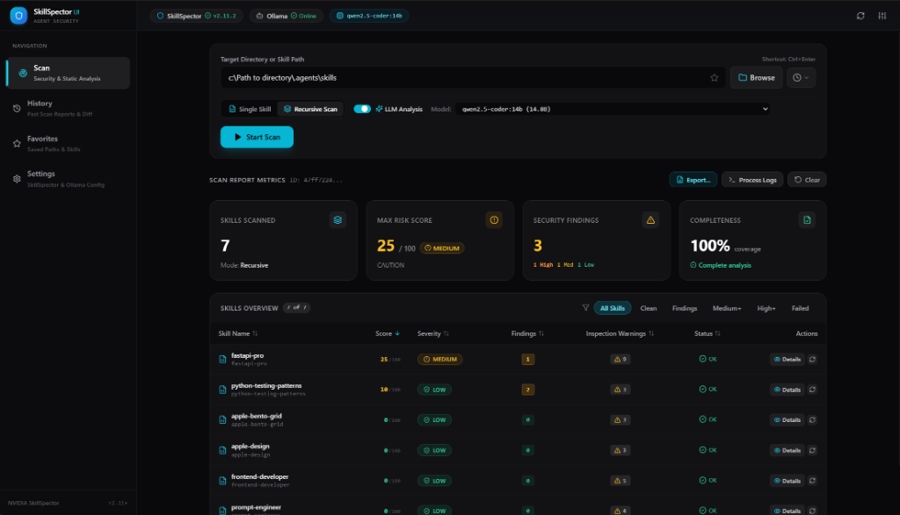
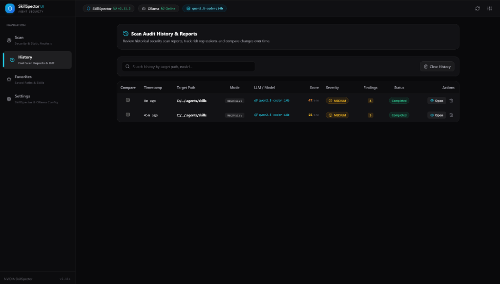
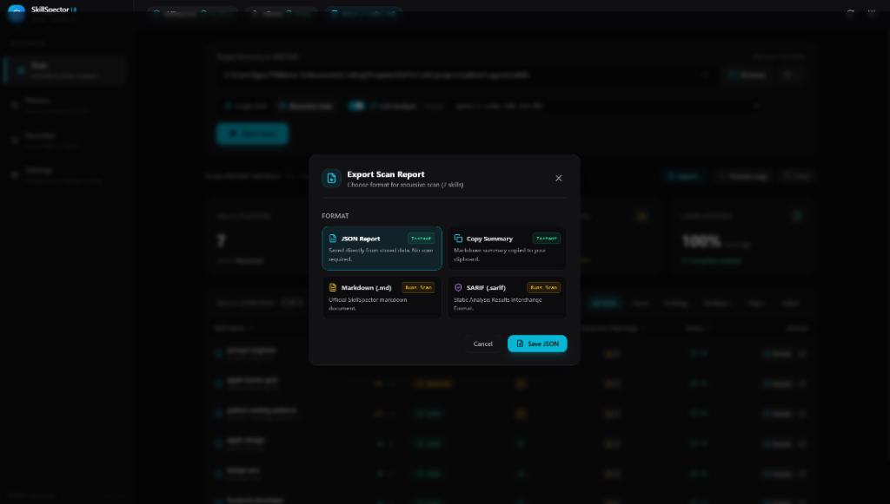
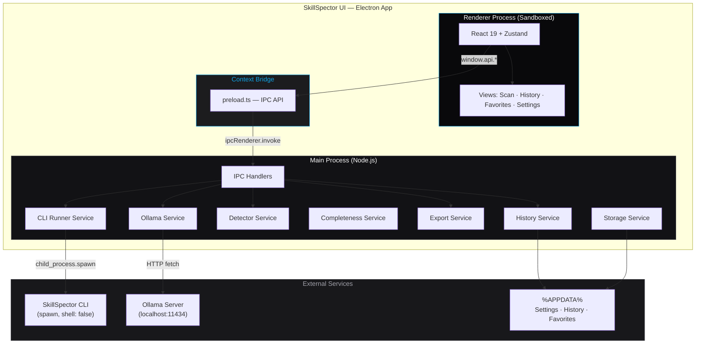
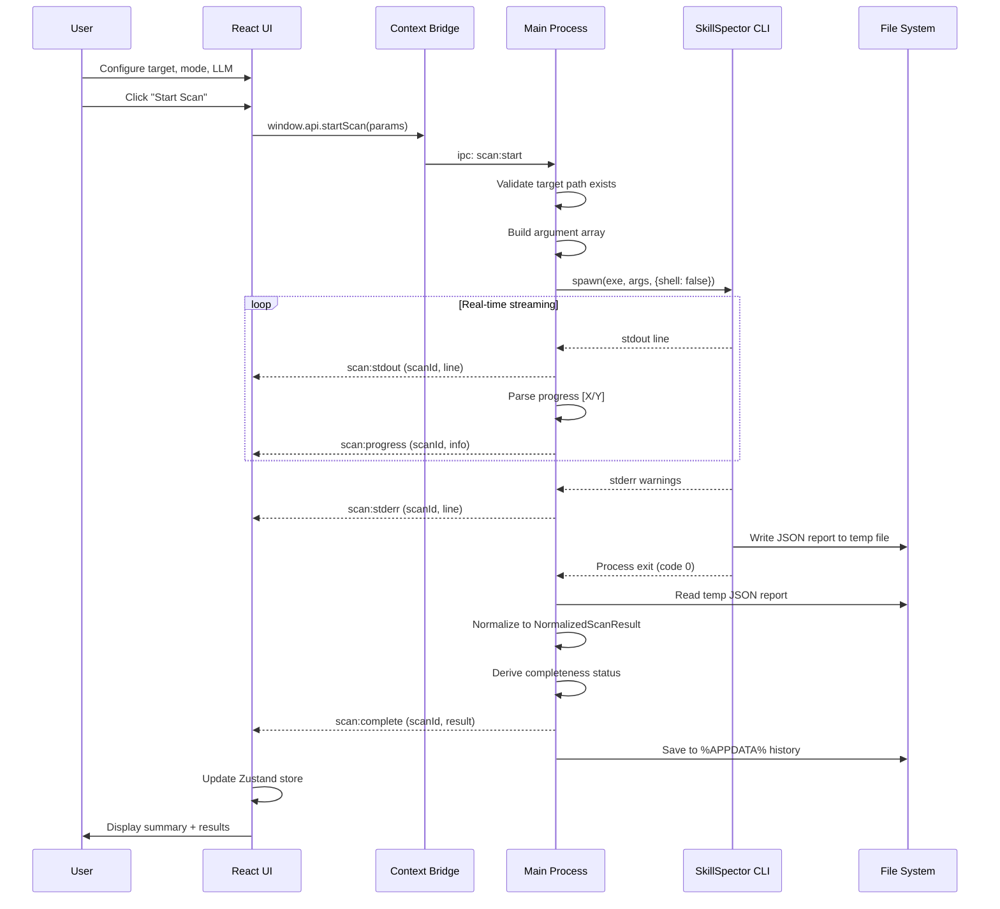
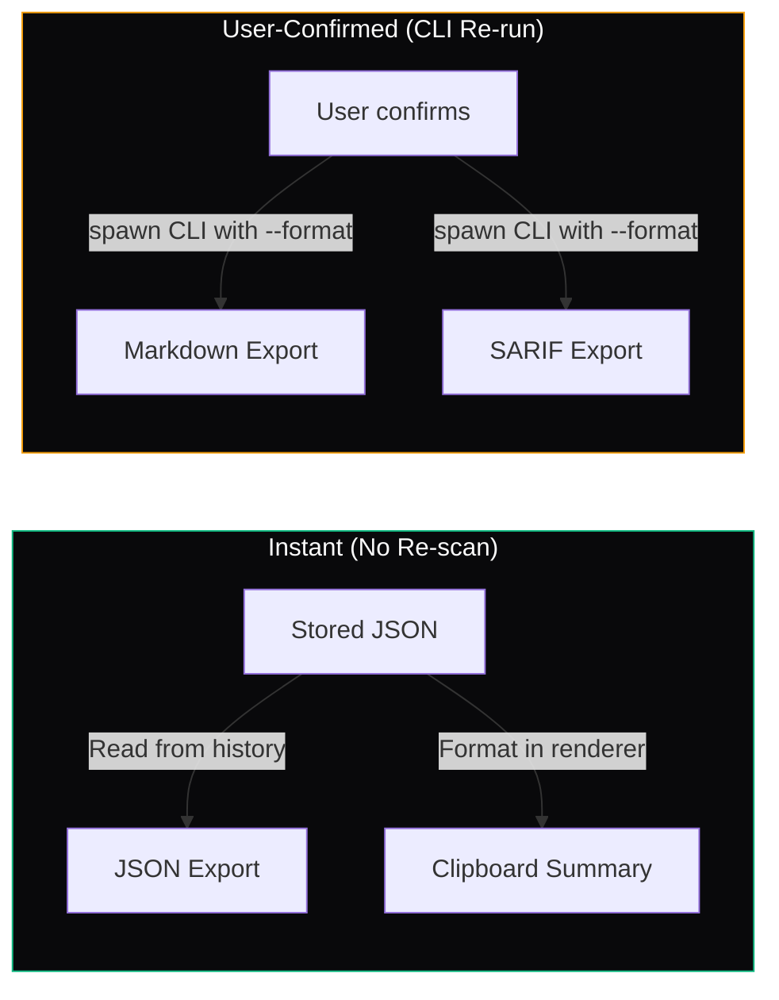
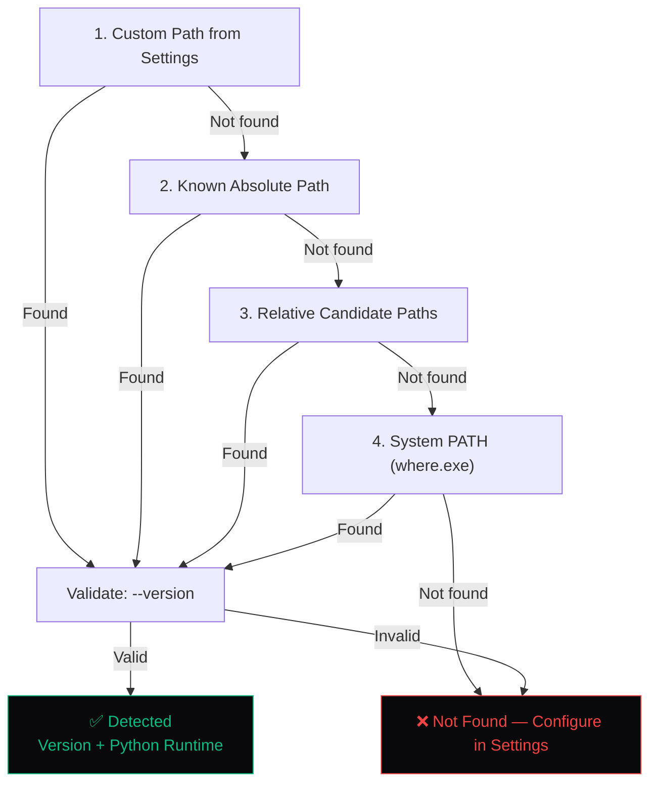

<div align="center">

# 🛡️ SkillSpector UI

**Desktop GUI for NVIDIA SkillSpector — AI Agent Security Scanner**

*Electron · React 19 · TypeScript · Tailwind CSS · Zustand*


</div>

---

## Overview

SkillSpector UI is a standalone Windows desktop application that provides a dedicated graphical interface for [**NVIDIA SkillSpector**](https://github.com/NVIDIA/skillspector) — the static security and quality scanner for AI agent skill packages.

Instead of running SkillSpector from the command line and manually parsing JSON output, SkillSpector UI wraps the entire workflow into a clean, keyboard-navigable desktop experience with real-time progress, structured results, scan history, and multi-format export.

> [!IMPORTANT]
> **This application requires [NVIDIA SkillSpector](https://github.com/NVIDIA/skillspector) to be installed.**
> SkillSpector UI is a frontend — it does not include the scanner itself. Install SkillSpector first, then the app auto-detects the installation and manages all subprocess calls internally. No virtual environment activation required.

---

## Screenshots

### Scan View — Configuration & Results



> Recursive scan of 7 skills with LLM-enhanced analysis (qwen2.5-coder:14b). Bento metric cards show skills scanned, max risk score, findings count, and completeness. Dense results table with severity badges, inspection warnings, and per-skill detail actions.

### History & Scan Comparison



> Browse past scan reports, track risk regressions, and compare changes over time. Each entry shows mode, LLM model, score, severity, findings count, and completion status.

### Multi-Format Export



> Export scan reports in multiple formats. JSON and Copy Summary are instant from stored data. Markdown and SARIF trigger SkillSpector's native formatters with user confirmation.


---

## Features

| Feature | Description |
|---------|-------------|
| **Auto-Detection** | Automatically locates `skillspector.exe` via known paths, relative candidates, or system PATH. Reports version and Python runtime. |
| **Single & Recursive Scans** | Scan a single skill folder or recursively scan multi-skill directories with real-time streaming progress (`[3/7] Scanning skill-name`). |
| **LLM-Enhanced Analysis** | Native Ollama integration — auto-detects local or LAN instances, enumerates models, and passes process-scoped environment variables. |
| **Bento Summary Cards** | Apple-inspired metric cards showing Security Score, Skills Analyzed, Findings count, and Analysis Completeness at a glance. |
| **Dense Results Table** | High-density sortable and filterable table with severity badges (always color + icon + text for accessibility). |
| **Three-Tier Warning Separation** | Security findings, inspection warnings (ledger exceptions), and runtime/config stderr warnings are strictly separated — never conflated. |
| **Transparent Detail Fallback** | Clicking a skill in recursive results transparently runs a deep single-skill scan if the recursive data lacks full detail. Cached for instant re-access. |
| **Scan History** | Every scan is persisted to `%APPDATA%` with lightweight index + full report files. Browse, favorite, delete, or compare past scans. |
| **Scan Comparison** | Side-by-side comparison of any two scans. Automatically detects non-equivalent configurations and uses neutral language instead of misleading "Improved"/"Resolved" labels. |
| **Multi-Format Export** | Instant JSON from stored data, clipboard markdown summary, and user-confirmed Markdown/SARIF via SkillSpector's native formatters. |
| **Favorites** | Bookmark frequently scanned directories with one-click quick-launch. |
| **Keyboard Shortcuts** | `Alt+1–4` for view switching, `Ctrl+Enter` to start scan. |
| **Safe Cancellation** | Process tree termination via `taskkill /PID /T /F` with safe argument arrays — no shell string interpolation. |

---

## Architecture

### System Overview



### Scan Workflow



### Data Flow — Export



---

## Security Model

SkillSpector UI enforces a strict Electron security boundary:

| Layer | Policy |
|-------|--------|
| **`contextIsolation`** | `true` — Renderer has no access to Node.js globals |
| **`nodeIntegration`** | `false` — No `require()` in renderer |
| **`sandbox`** | `true` — Chromium sandbox enforced |
| **Preload API** | Explicit allowlist of IPC channels via `contextBridge` |
| **IPC Validation** | All renderer-controlled arguments validated in main process |
| **Subprocess Execution** | `spawn()` only, `shell: false`, explicit argument arrays |
| **Path Validation** | `fs.realpathSync` prevents symlink/junction traversal attacks |
| **No Generic Shell** | No `exec()`, no command-string construction, no arbitrary code execution |
| **Process-Scoped Env** | LLM provider variables set per-spawn, never mutate global `process.env` |

### IPC Channel Allowlist

The renderer can only call these channels through the typed `window.api` bridge:

```
Dialogs       selectFolder · selectFile · saveFileDialog
Detection     skillspector:status · skillspector:test
Ollama        ollama:status · ollama:models
Scanning      scan:start · scan:cancel · scan:single-skill
Settings      settings:get · settings:save
History       history:index · history:report · history:delete · history:clear
Favorites     favorites:get · favorites:save · favorites:delete
Shell         shell:open-file · shell:copy-text
Export        export:report · export:scan-and-export
```

---

## Project Structure

```
skillspector-ui/
├── electron/                     # Main process (Node.js)
│   ├── main.ts                   # App lifecycle, window creation, security config
│   ├── preload.ts                # Context bridge — typed IPC API surface
│   ├── types.ts                  # Shared types & IPC contract
│   ├── ipc/                      # Modular IPC handler registrations
│   │   ├── index.ts              # Central handler registry
│   │   ├── dialogs.ts            # OS file/folder dialogs
│   │   ├── export.ts             # JSON dump & CLI format export
│   │   ├── favorites.ts          # Favorites persistence
│   │   ├── history.ts            # Scan history management
│   │   ├── ollama.ts             # Ollama status & model queries
│   │   ├── scan.ts               # Scan start/cancel/single-skill
│   │   ├── settings.ts           # Settings & detector integration
│   │   └── shell.ts              # Safe file-open & clipboard
│   └── services/                 # Business logic
│       ├── runner.ts             # CLI spawn, progress parsing, normalization
│       ├── detector.ts           # Auto-detect skillspector.exe (4-tier waterfall)
│       ├── completeness.ts       # Analysis completeness derivation
│       ├── export.ts             # Export orchestration
│       ├── history.ts            # Two-tier persistence (index + reports)
│       ├── ollama.ts             # HTTP client for Ollama REST API
│       └── storage.ts            # Atomic read/write with temp+rename
│
├── src/                          # Renderer process (React)
│   ├── App.tsx                   # Root layout with view routing
│   ├── main.tsx                  # React DOM root mount
│   ├── index.css                 # Tailwind imports & design tokens
│   ├── components/
│   │   ├── layout/               # Sidebar, Header
│   │   ├── scan/                 # ScanConfig, ScanProgress, ScanSummary,
│   │   │                         # ResultsTable, FindingsList, SkillDetail,
│   │   │                         # CompletenessCard, ExportModal, RawOutput,
│   │   │                         # ScanWarnings, InspectionWarnings
│   │   ├── history/              # HistoryList, ScanComparison
│   │   ├── favorites/            # FavoritesList
│   │   └── settings/             # SettingsPage
│   ├── views/                    # ScanView, HistoryView, FavoritesView, SettingsView
│   ├── stores/                   # Zustand state management
│   │   ├── appStore.ts           # App-wide state (detection, ollama, settings)
│   │   └── scanStore.ts          # Scan execution, results, filtering, caching
│   ├── lib/                      # Pure utility functions
│   │   ├── completeness.ts       # UI completeness re-derivation
│   │   └── comparison.ts         # Scan comparability & finding matching
│   └── types/                    # Frontend type definitions
│       ├── api.ts                # NormalizedScanResult, NormalizedSkillResult
│       └── skillspector.ts       # View types, filter options
│
├── scripts/                      # Verification & regression test scripts
│   ├── verify.ts                 # Core architecture tests
│   ├── verify-fixes.ts           # Security fix regression tests
│   ├── verify-presentation-fixes.ts
│   ├── verify-recursive-completeness.ts
│   └── verify-scan-comparison.ts
│
├── launch.bat                    # Windows one-click launcher
├── package.json
├── vite.config.ts
├── tailwind.config.cjs
├── tsconfig.json                 # Renderer TypeScript config
└── tsconfig.node.json            # Electron/Node TypeScript config
```

---

## Prerequisites

| Requirement | Version | Notes |
|-------------|---------|-------|
| **Node.js** | ≥ 18 | Required for Electron and Vite |
| **npm** | ≥ 9 | Included with Node.js |
| **[NVIDIA SkillSpector](https://github.com/NVIDIA/skillspector)** | ≥ 2.11 | **Required.** Install with Python venv per [NVIDIA's instructions](https://github.com/NVIDIA/skillspector#installation). Auto-detected or configurable in Settings. |
| **Ollama** *(optional)* | Any | Only needed for LLM-enhanced semantic analysis. Auto-detected at `localhost:11434`. |

---

## Getting Started

### Install Dependencies

```bash
npm install
```

### Launch

**Option A — One-Click (Windows)**

Double-click `launch.bat`. It auto-builds on first run if needed.

**Option B — Terminal**

```bash
npm start
```

### Development Mode

Hot-reloading with Vite dev server and Electron:

```bash
npm run electron:dev
```

Or frontend-only dev server (no Electron window):

```bash
npm run dev
```

### Type Checking

```bash
npm run typecheck
```

### Production Build

```bash
npm run build
```

---

## Keyboard Shortcuts

| Shortcut | Action |
|----------|--------|
| `Alt + 1` | Switch to Scan view |
| `Alt + 2` | Switch to History view |
| `Alt + 3` | Switch to Favorites view |
| `Alt + 4` | Switch to Settings view |
| `Ctrl + Enter` | Start scan (when target path is set) |

---

## Data Storage

All runtime data is stored in `%APPDATA%\SkillSpector UI\` — the NVIDIA SkillSpector repository is never modified.

```
%APPDATA%\SkillSpector UI\
├── settings.json          # App configuration
├── favorites.json         # Bookmarked scan targets
├── recent-paths.json      # Recently used target paths
└── history/
    ├── index.json          # Lightweight scan index (metadata only)
    └── scans/
        ├── <uuid>.json     # Full NormalizedScanResult for each scan
        └── ...
```

---

## SkillSpector Detection

The app uses a 4-tier waterfall to locate `skillspector.exe`:



---

## Verification Scripts

Run regression and architecture tests without modifying source code:

```bash
npx tsx scripts/verify.ts                        # Core architecture (17 tests)
npx tsx scripts/verify-fixes.ts                  # Security fix regressions (38 tests)
npx tsx scripts/verify-presentation-fixes.ts     # Presentation correctness (18 tests)
npx tsx scripts/verify-recursive-completeness.ts # Completeness derivation (36 tests)
npx tsx scripts/verify-scan-comparison.ts        # Comparison semantics (35 tests)
```

---

## Tech Stack

| Layer | Technology | Purpose |
|-------|-----------|---------|
| Desktop Runtime | Electron 35 | Sandboxed Chromium + Node.js |
| Frontend Framework | React 19 | Component-based UI |
| State Management | Zustand 5 | Lightweight stores with IPC bridge |
| Styling | Tailwind CSS 3 | Utility-first, Apple dark aesthetic |
| Icons | Lucide React | Consistent icon set |
| Bundler | Vite 6 | Fast HMR and production builds |
| Type System | TypeScript 5.8 | End-to-end type safety |
| CLI Integration | child_process.spawn | Secure subprocess execution |

---

## Design System

The UI follows an Apple-inspired dark design system:

- **Canvas**: Pitch-dark background `#09090b`
- **Card Surfaces**: Elevated panels `#121215` / `#18181c`
- **Borders**: Hairline `rgba(255, 255, 255, 0.08)`
- **Typography**: High-contrast white `#fafafa`, secondary `#86868b`
- **Accent**: Cyan `#0ea5e9` for interactive elements and active states
- **Severity**: Always communicated via color + icon + text label (never color alone)
- **Layout**: Two-layer depth — content layer (solid surfaces) and functional layer (sidebar, header, dialogs with `backdrop-blur-xl`)

---

## License & Attribution

© 2026 [0xFloCode](https://github.com/0xFloCode). All rights reserved.

This project is an **independent, third-party desktop frontend** for [NVIDIA SkillSpector](https://github.com/NVIDIA/skillspector).
It is **not affiliated with, endorsed by, or sponsored by NVIDIA Corporation**.

- **SkillSpector UI** (this project): Private / All rights reserved.
- **NVIDIA SkillSpector** (the CLI scanner): Licensed under the [Apache License 2.0](https://github.com/NVIDIA/skillspector/blob/main/LICENSE) by NVIDIA Corporation.
- **NVIDIA** and **SkillSpector** are trademarks of NVIDIA Corporation.

This application does not modify, bundle, or redistribute any part of NVIDIA SkillSpector. It invokes the separately installed CLI as a subprocess.

---

<div align="center">

*Built with [NVIDIA SkillSpector](https://github.com/NVIDIA/skillspector) · Electron · React · TypeScript*

</div>
